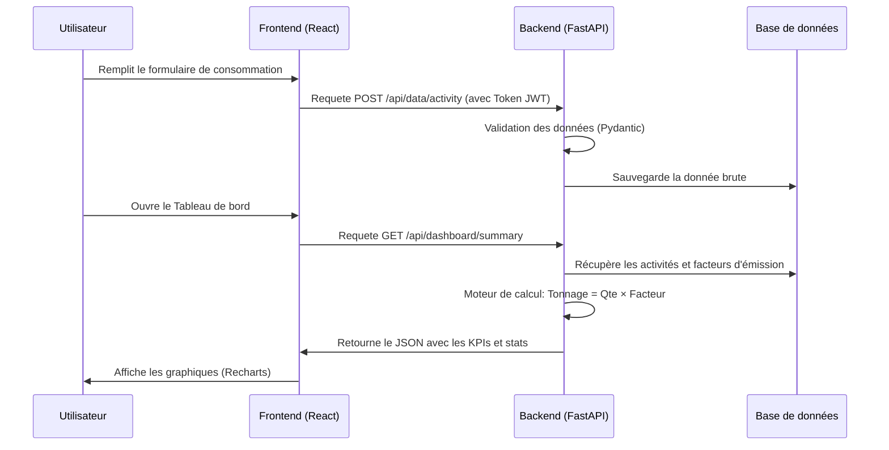

# 🏛️ DOSSIER TECHNIQUE : SMART GREEN ENSIT

> [!NOTE]
> Ce document décrit l'architecture globale, les choix technologiques et les flux de données de la plateforme **SMART GREEN ENSIT**. Il est destiné au jury d'évaluation technique.

---

## 1. 🏗️ ARCHITECTURE GLOBALE

L'application repose sur une architecture moderne de type **Microservices (conteneurisée)**, séparant rigoureusement la présentation, la logique métier et la persistance des données.

```mermaid
graph TD
    User([👤 Utilisateur / Jury])
    
    subgraph "Docker Compose Environnement"
        Nginx[🌐 Nginx Reverse Proxy<br/>Port 80]
        
        subgraph "Frontend"
            React[⚛️ React / Vite SPA<br/>Port 3000]
        end
        
        subgraph "Backend"
            FastAPI[⚡ FastAPI (Python)<br/>Port 8000]
            AI[🧠 Scikit-Learn<br/>Engine]
        end
        
        subgraph "Database"
            Postgres[(🐘 PostgreSQL<br/>Port 5432)]
            Admin[🔧 pgAdmin<br/>Port 5050]
        end
        
        User -->|HTTP/HTTPS| Nginx
        Nginx -->|/api/*| FastAPI
        Nginx -->|/*| React
        FastAPI <-->|SQLAlchemy ORM| Postgres
        FastAPI <-->|Training & Inference| AI
        Admin <--> Postgres
    end
```

> [!TIP]
> **Pourquoi cette architecture ?** 
> La conteneurisation garantit que l'application s'exécute de la même manière sur l'ordinateur du développeur, sur le serveur de l'ENSIT ou sur l'ordinateur du jury, sans aucun conflit de dépendances.

---

## 2. 🧩 LES MODULES DÉVELOPPÉS

La plateforme est structurée en **4 modules métiers principaux**, complétés par un module d'administration transversal :

### 📥 A. Module de Collecte (Acquisition)
Ce module est la porte d'entrée des données brutes.
- **Données énergétiques** : Interface de saisie des factures (électricité, gaz) avec spécification de la quantité, de la période et du bâtiment.
- **Enquêtes de mobilité** : Formulaire permettant de déclarer les trajets domicile-campus. Le module convertit automatiquement ces déclarations (mode de transport, distance, fréquence) en données exploitables.

### ⚙️ B. Module de Calcul (Processing)
C'est le moteur invisible (Backend) de l'application.
- Applique la méthodologie normalisée : `Émissions = Quantité × Facteur d'émission`.
- Agrége automatiquement les résultats selon les normes internationales (**Scope 1, 2, et 3**).

### 🔮 C. Module d'Analyse et de Simulation (Intelligence)
- **Simulateur "What-If"** : Permet de créer des scénarios (ex: *"-20% sur l'électricité du Bâtiment A"*) et de comparer visuellement l'impact direct sur l'empreinte carbone.
- **Prédiction IA** : Intègre un modèle de Machine Learning (**Gradient Boosting Regressor**) qui analyse l'historique des consommations pour prédire l'empreinte carbone des 12 prochains mois.

### 📊 D. Module de Visualisation (Dashboard)
L'interface de restitution graphique à destination des décideurs.
- **Indicateurs (KPIs)** : Émissions totales, par étudiant et par mètre carré.
- **Graphiques** : Évolution temporelle (aires empilées) et répartition par source.
- **Classement** : Identification immédiate des bâtiments les plus énergivores.

---

## 3. 🔄 LES FLUX DE DONNÉES

Le traitement d'une information suit un cycle de vie strict et sécurisé :



---

## 4. 🛠️ LES CHOIX TECHNOLOGIQUES

> [!IMPORTANT]
> Chaque technologie a été choisie pour répondre à un besoin spécifique de performance, de scalabilité ou de sécurité.

| Couche | Technologie | Justification du choix |
| :--- | :--- | :--- |
| **Frontend UI** | **React 19 + TypeScript** | Écosystème robuste. TypeScript évite les erreurs d'exécution. L'utilisation de composants réutilisables accélère le développement. |
| **Stylisation** | **TailwindCSS** | Permet de créer une interface moderne (Glassmorphism, Dark mode) très rapidement sans écrire de fichiers CSS lourds. |
| **Backend API** | **Python + FastAPI** | Framework extrêmement rapide. Génère automatiquement la documentation (Swagger). Python est indispensable pour l'intégration de l'IA. |
| **Persistance** | **PostgreSQL** | Base de données relationnelle stricte, garantissant l'intégrité des données complexes (liens entre utilisateurs, bâtiments et activités). |
| **Intelligence**| **Scikit-Learn** | Bibliothèque Python de référence. Le modèle de Gradient Boosting excelle sur les séries temporelles avec peu de dimensions (comme la consommation d'énergie). |
| **Déploiement**| **Docker Compose** | Orchestration simple et reproductible. Permet au jury de tester le projet en une seule ligne de commande. |
